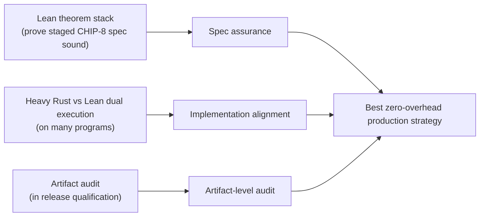

# Nightstream Lean Bridge

This package is the composition layer above the standalone
[superneo-lean](/Users/nicolasarqueros/starstream/develop/nightstream-clean-up/formal/superneo-lean/README.md)
and
[twist-shout-lean](/Users/nicolasarqueros/starstream/develop/nightstream-clean-up/formal/twist-shout-lean/README.md)
packages.

Its job is not to re-prove either paper.
Its job is to formalize the mathematical bridge needed to justify the Rust
architecture that combines:

- SuperNeo main-lane folding, and
- Twist/Shout-derived obligation production and classification.

## Design Rules

- Keep this package composition-specific. Do not move standalone paper logic here.
- Import theorem-facing interface files from dependencies where possible.
- Validate semantic architecture decisions, not Rust file boundaries.
- Start with bridge types and fold-admissibility before transcript or PCS refinement.

## Layout

### Bridge (composition layer)

- `specs/BridgeTypes.spec.md`: typed obligation and lane-decision surface.
- `specs/ClaimedMemorySemantics.spec.md`: semantic target for Shout read-only traces and Twist read/write traces.
- `specs/Projection.spec.md`: Twist/Shout as an obligation-producing projection path.
- `specs/FoldAdmissibility.spec.md`: what may merge into the main lane, what may fold separately, and what must remain final.
- `specs/MainLaneBridge.spec.md`: exact condition under which a projected family may enter the SuperNeo main lane.
- `specs/ShardComposition.spec.md`: family-policy routing theorems for typed emitted families.
- `specs/PCSOpeningSemantics.spec.md`: explicit refinement boundary between
  lower-layer Ajtai opening witnesses and raw scalar opening values consumed by
  Nightstream.
- `specs/NonZeroInitTwist.spec.md`: bridge-layer modified `init + Inc -> Val`
  identities for instantiations that authenticate a non-zero initial memory
  surface directly instead of reducing to zero-init preload writes.
- `Nightstream/ClaimedMemorySemanticsInterface.lean`
- `Nightstream/ClaimedMemorySemantics.lean`
- `Nightstream/BridgeTypesInterface.lean`
- `Nightstream/BridgeTypes.lean`
- `Nightstream/ProjectionInterface.lean`
- `Nightstream/Projection.lean`
- `Nightstream/FoldAdmissibilityInterface.lean`
- `Nightstream/FoldAdmissibility.lean`
- `Nightstream/MainLaneBridgeInterface.lean`
- `Nightstream/MainLaneBridge.lean`
- `Nightstream/ShardCompositionInterface.lean`
- `Nightstream/ShardComposition.lean`
- `Nightstream/PCSOpeningSemanticsInterface.lean`
- `Nightstream/PCSOpeningSemantics.lean`
- `Nightstream/NonZeroInitTwistInterface.lean`
- `Nightstream/NonZeroInitTwist.lean`
- `Nightstream/Chip8/ReleaseBridgeInterface.lean`
- `Nightstream/Chip8/ReleaseBridge.lean`
- `Nightstream/Chip8/StagedBridgeInterface.lean`
- `Nightstream/Chip8/StagedBridge.lean`

### CHIP-8 VM constraint system

Current directory ownership is partially nested:

- `Nightstream/Chip8/Kernel/`: kernel-boundary, transcript, digest, and audit
  modules.
- `Nightstream/Chip8/Stage1/`: routing, fetch/decode, and decoded-address
  binding modules.
- `Nightstream/Chip8/Stage2/`: Stage-2 memory/value binding, exact evidence
  coverage, and Twist session/temporal reconstruction modules.
- `Nightstream/Chip8/Stage3/`: continuity, row-binding, and semantic `pc`
  bridge modules.
- `Nightstream/Chip8/Trace/`: chunk-trace closure, temporal linking, and
  trace-boundary modules.
- `Nightstream/Chip8/Execution/`: execution semantics, exact-frame
  extraction, burst composition, and supported-step correctness modules.

- `specs/chip8/Chip8Routing.spec.md`: exact row-local routing soundness for the
  final 24-coordinate CHIP-8 kernel row. Proves that `VX_NEXT`, `I_NEXT`, and
  `PC_NEXT` are forced by the authenticated row-local equations together with
  the imported decode and lane projections.
- `specs/chip8/Chip8FetchDecodeBinding.spec.md`: exact CHIP-8 ROM fetch and
  opcode decoding surface for the supported 9-family kernel. Proves that a
  fixed ROM word and `PC` determine the exact authenticated Stage-1 decode,
  ALU/Eq4 lookup keys, and the decode handoff consumed by the main lane and
  Stage 2.
- `specs/chip8/Chip8InstructionSemanticsLookupProjection.spec.md`: concrete
  CHIP-8 Stage-1 release-path owner for the `InstructionSemanticsLookup`
  family. Packages the authenticated ALU-helper and burst-equality helper
  facts into one exact helper-record surface and proves that this
  `ShoutReadEval` family stays out of the main lane unless a later owner
  explicitly supports a separate fold.
- `specs/chip8/Chip8ReleaseBridge.spec.md`: concrete CHIP-8 release-path
  bridge owner above the four individual extension families. Packages the
  Rust-planner family-to-stage split, one concrete readonly-batch Stage-1
  bundle, and one concrete Stage-2 history bundle that a later staged bridge
  artifact can consume directly.
- `specs/chip8/Chip8StagedBridge.spec.md`: concrete staged bridge artifact
  replacing the compatibility bridge shape. Packages the canonical public
  bridge view, the exact prepared-step export, the ordered readonly-batch
  bundle trace, and the exact Stage-2 history bundle that the backend is
  allowed to consume.
- `specs/chip8/Chip8DecodeAddressBinding.spec.md`: CHIP-8-local decoded index
  and address-role binding surface. Proves that every Stage-1 or Stage-2
  address family is exactly the family-specific projection determined by the
  authenticated decoded row and lane values.
- `specs/chip8/Chip8WitnessMemoryBinding.spec.md`: CHIP-8-local semantic
  witness and memory binding surface. Proves that the exact 24-coordinate row,
  Stage-2 register/RAM read and write families, virtual value families, sink
  routing, RAM RAF support, and initial-state authentication are all bound to
  semantic pre/post state and the decoded step.
- `specs/chip8/Chip8TwistConcreteBinding.spec.md`: concrete CHIP-8 Twist
  instantiation surface for registers and RAM. Owns the exact bit-point
  identities for shifted `RegVal` / `RamVal` tables, read checks, write checks,
  and non-zero-init value evaluation.
- `specs/chip8/Chip8TwistRoleSessions.spec.md`: row-local Stage-2 session
  extraction surface. Owns the explicit per-role register and RAM Twist
  sessions that one authenticated temporal seed must expose before any
  trace-global reconstruction theorem can be proved.
- `specs/chip8/Chip8TwistTraceRoleSessions.spec.md`: exact-trace Stage-2 role
  extraction surface. Owns the passage from exact authenticated frame evidence
  to explicit per-row register and conditional RAM role sessions across the
  whole trace.
- `specs/chip8/Chip8RegisterHistoryProjection.spec.md`: concrete CHIP-8
  Stage-2 release-path owner for the `RegisterHistory` family. Packages the
  exact non-zero-init register surface, exact register-side role-session
  extraction, and canonical register timeline consequence into one exact
  `TwistValEval` family that stays out of the main lane unless a later owner
  explicitly supports a separate fold.
- `specs/chip8/Chip8RamHistoryProjection.spec.md`: concrete CHIP-8 Stage-2
  release-path owner for the `RamHistory` family. Packages the exact
  non-zero-init RAM surface, exact opcode-guarded RAM role-session extraction,
  and canonical RAM timeline consequence into one exact `TwistValEval` family
  that stays out of the main lane unless a later owner explicitly supports a
  separate fold.
- `specs/chip8/Chip8RegisterTimeline.spec.md`: exact Stage-2 register / `I`
  timeline surface. Owns the absolute-time contract relating authenticated
  register pre/post state to the `RegVal` timeline exported by the protocol.
- `specs/chip8/Chip8RamTimeline.spec.md`: exact Stage-2 RAM timeline surface.
  Owns the absolute-time contract relating authenticated RAM pre/post state to
  the `RamVal` timeline exported by the protocol.
- `specs/chip8/Chip8PcContinuityBridge.spec.md`: theorem-facing Stage-3 `pc`
  bridge. Owns the exact semantic support surface needed to turn checked
  lane-shift continuity data into real adjacent-row `pc` equality.
- `specs/chip8/Chip8PaddedContinuityCheck.spec.md`: low-level Stage-3 padded
  continuity owner beneath the theorem-facing Stage-3 contract.
- `specs/chip8/Chip8Stage3Refinement.spec.md`: explicit refinement from the
  low-level padded Stage-3 check to the row-local continuity surface.
- `specs/chip8/Chip8TemporalConsistency.spec.md`: component-wise temporal trace
  surface. Composes `Chip8RegisterTimeline`, `Chip8RamTimeline`, and
  `Chip8PcContinuityBridge` into exact adjacent-state linking across the
  authenticated semantic prefix.
- `specs/chip8/Chip8ChunkInput.spec.md`: simple-kernel semantic chunk input
  contract. Owns the exact semantic-row count and head initial-state agreement
  that belong to the kernel input boundary rather than to Stage 1 / Stage 2 /
  Stage 3 extraction.
- `specs/chip8/Chip8TraceLinkBoundary.spec.md`: exact whole-trace state-link
  contract. Owns the named adjacent-frame machine-state handoff law
  `TraceLinkBound`, proves that it is equivalent to raw `ExecutionLinked`, and
  fixes the named contract that higher-level authenticated trace closure must
  derive.
- `specs/chip8/Chip8MainLaneTraceBoundary.spec.md`: explicit root/main-lane
  trace boundary. Owns the wider explicit contract that packages whole-trace
  routing and the named whole-trace link contract together for consumers that
  want both, even though the critical authenticated-trace closure is expected
  to discharge the exact link theorem directly.
- `specs/chip8/Chip8ExecutionSemantics.spec.md`: shared semantic-state and
  authenticated execution-trace surface for the supported CHIP-8 kernel. Owns
  `MicrostepCorrect`, `InstructionCorrect`, row-backed execution frames,
  chunk-local execution traces, and prepared-step export predicates shared by
  `StepComposition` and `BurstSession`.
- `specs/chip8/Chip8RomScheduleBinding.spec.md`: authenticated public-input
  binding surface for the final CHIP-8 kernel. Proves that the published
  program digest, program shape metadata, pad-row metadata, initial-state
  digests, and root parameters determine the exact semantic kernel inputs.
- `specs/chip8/Chip8MetaPubEncoding.spec.md`: exact theorem-facing `KernelMetaPub`
  payload and canonical labeled `meta_pub` absorb plan for `root0`.
- `specs/chip8/Chip8Poseidon2Transcript.spec.md`: exact Rust-compatible
  Poseidon2 transcript packing, domain separation, and `root0` transcript-input
  semantics beneath the hash permutation.
- `specs/chip8/Chip8Root0Digest.spec.md`: exact width-8/rate-4 sponge-state
  evolution for `digest32`, `challenge_field`, and the resulting `root0` digest
  bytes, leaving only the concrete Poseidon2 permutation as an explicit
  parameter.
- `specs/chip8/Chip8Poseidon2GoldilocksCore.spec.md`: exact concrete width-8
  Poseidon2-over-Goldilocks permutation for the seeded simple-kernel transcript,
  freezing the generated round constants and exposing golden-vector conformance
  points for Rust↔Lean parity.
- `specs/chip8/Chip8ChallengeDerivation.spec.md`: exact Rust-compatible
  `sample_k` / `sample_point` semantics for the explicit shared CHIP-8 kernel
  challenges and labeled terminal points, including the fact that Stage-1
  `r_lookup` continues from the pre-digest `root0` transcript cursor rather
  than from `digest32(root0)`.
- `specs/chip8/Chip8ConcreteTranscriptParity.spec.md`: exact concrete
  specialization of the generic `root0` digest and shared kernel challenge
  layer to the frozen width-8 Poseidon2-over-Goldilocks core.
- `specs/chip8/Chip8Checks.spec.md`: executable Layer-2 Rust↔Lean parity lane
  for generated CHIP-8 protocol vectors. Checks exact equality for the shared
  transcript-bound challenge surface, exact rebuild parity for the
  chunk-level staged execution digest bundle exported by Rust, and grouped
  release-artifact consistency for the combined kernel-digest plus staged-bundle
  export and the proof-free external artifact schema that Rust now emits for
  Lean release checks.
- `specs/chip8/Chip8Root0Preimage.spec.md`: exact combined phase-0 `root0`
  preimage, joining the canonical commitment absorbs with the exact lifted
  `meta_pub` absorb plan before any concrete hash function.
- `specs/chip8/Chip8OpeningBoundary.spec.md`: authenticated direct-opening
  manifest surface for the CHIP-8 kernel and root. Proves that the kernel and
  root expose only manifest-declared direct openings, with Stage 1 owned by
  Shout, Stage 2 owned by Twist, and Stage 3 owned by continuity/bridge
  objects.
- `specs/chip8/Chip8TranscriptSchedule.spec.md`: exact `root0` commitment
  bundle and exact Fiat-Shamir transcript-order surface for the CHIP-8 kernel.
  Proves the commitment-before-challenge discipline, exact stage ordering,
  terminal-point recording rules, and exact Stage-3 row-binding coverage over
  the semantic prefix.
- `specs/chip8/Chip8SoundnessAccounting.spec.md`: exact parameterized
  soundness-accounting surface for the CHIP-8 kernel. Proves that the full
  Stage-1 / Stage-2 / Stage-3 / batching / PCS / Fiat-Shamir /
  outer-composition budget required by the kernel spec closes to a negligible
  total term once all primitive boundary terms are negligible.
- `specs/chip8/Chip8ContinuityBridge.spec.md`: exact Stage-3 continuity and
  bridge-binding surface. Proves that `LaneShiftProof`, continuity identities,
  start-boundary / final-boundary checks, row bindings, and `PreparedStep`
  export are all tied to authenticated lane and root openings.
- `specs/chip8/Chip8EvidenceCoverage.spec.md`: claim-to-semantics extraction
  surface. Proves that authenticated manifests, Stage-1/Stage-2/Stage-3
  objects, object-level provenance, Twist-session closure, row projection, and
  lower-layer PCS opening refinement are sufficient to recover the semantic
  facts consumed by the CHIP-8 composition theorem, with an exact theorem-facing
  coverage predicate that hides any internal stage-local witness lists.
- `specs/chip8/Chip8AuthenticatedTrace.spec.md`: exact chunk-level closure from
  row-local authenticated evidence and state-well-formedness, together with the
  simple-kernel chunk input contract, into the authenticated chunk-trace
  surface, the explicit per-row Stage-2 temporal seed summary, one chunk-global
  Stage-2 temporal context plus the Stage-3 `pc` bridge as the named
  authenticated temporal-support bundle, exact adjacent-state linking, exact
  `ExecutionCorrect`, and exact prepared-step export.
- The intended theorem-level kernel closure objects are
  `Stage2TemporalContext` for Stage 2 and `PcAdjacentBridge` for Stage 3. They
  are not direct opening claims and not audit/provenance summaries.
- `specs/chip8/Chip8KernelSoundness.spec.md`: exact top-level CHIP-8 kernel
  soundness conclusion above authenticated chunk-trace closure,
  opening-boundary discipline, transcript schedule, and parameterized
  soundness accounting, with the protocol-shaped authenticated temporal-support
  bundle included directly in the kernel acceptance boundary and exact whole-
  trace execution correctness recovered at that same boundary.
- `specs/chip8/Chip8KernelExecutionDigest.spec.md`: exact kernel-level digest
  contract above `Chip8KernelSoundness`. Packages the authenticated chunk
  trace, the exact per-row Stage-2 temporal seed summary, the named
  authenticated temporal-support bundle (chunk-global Stage-2 temporal context
  plus Stage-3 `pc` bridge), prepared-step export, row-projection /
  bridge-binding audit summaries, root/transcript manifest surfaces, and total
  soundness budget into one explicit theorem-facing kernel digest boundary.
- `specs/chip8/Chip8KernelArtifactAudit.spec.md`: exact audit-checker surface
  for the kernel execution digest. Proves that accepted kernel digest
  instances recover the full kernel conclusion bundle, including exact
  execution correctness, the named authenticated temporal-support bundle, and
  the exact kernel row-summary audit surface.
- `specs/chip8/Chip8AuditSummary.md`: short auditor-facing index for the
  CHIP-8 bundle. Centralizes manifest ownership, `root0`, public-input
  binding, exact trace closure, and the top-level kernel theorem.
- `specs/chip8/Chip8BridgeBinding.spec.md`: exact per-row audit/provenance
  owner connecting an authenticated Stage-3 row-binding claim to the exported
  prepared step, while separately exposing the authenticated row-projection
  witness required by the kernel audit trail.
- `specs/chip8/Chip8StagedExecutionDigest.spec.md`: Lean-defined normalized
  digest contract for a staged kernel execution. Packages the exact public-input
  surface, Stage-1/Stage-2/Stage-3 theorem surfaces, and final semantic result
  into one explicit comparison and audit boundary shared by Rust and Lean.
- `specs/chip8/Chip8StagedExecutionDigestBundle.spec.md`: Lean-defined
  chunk-level bundle owner for normalized staged execution digests. Packages one
  theorem-facing public surface plus one ordered per-frame staged digest entry
  for an exact authenticated CHIP-8 frame list.
- `specs/chip8/Chip8StagedExecutionBundleAudit.spec.md`: chunk-level audit
  acceptance layer above the Lean-owned staged digest bundle. Recovers exact
  per-entry slice audit acceptance, execution-frame consequences, and
  semantic-row alignment from one accepted chunk bundle.
- `specs/chip8/Chip8ReleaseArtifact.spec.md`: final theorem-facing release
  package above the normalized kernel digest and the accepted chunk-ordered
  staged bundle. Keeps the simple-kernel chunk-input contract explicit and
  gives the external import/export owner one Lean-owned target object.
- `specs/chip8/Chip8ReleaseArtifactAudit.spec.md`: final Layer-3 checker above
  `Chip8ReleaseArtifact`. Recovers kernel-level soundness consequences,
  per-entry staged-bundle consequences, and packaged export-count alignment
  from one accepted release artifact.
- `specs/chip8/Chip8ExternalReleaseArtifact.spec.md`: proof-free external
  release-artifact schema above `Chip8ReleaseArtifact`. Fixes the exact Rust
  import surface that Lean checks using `root0` bindings, trace digests, exact
  frames, Stage-3 digest sources, and the grouped release-artifact view.
- `specs/chip8/Chip8ExternalReleaseArtifactAudit.spec.md`: executable Lean
  checker over the imported external release artifact. Validates the imported
  grouped surfaces against Lean-owned source rebuilds and preserves the final
  row-path/count invariants needed for release qualification.
- `specs/chip8/Chip8ArtifactAudit.spec.md`: Lean audit-checker surface for the
  staged execution digest. Proves that accepted digest instances satisfy the
  exact theorem-facing conditions required by the CHIP-8 composition theorem.
- `specs/chip8/Chip8BurstSession.spec.md`: exact decomposed-instruction session
  surface for `StoreRegs` / `LoadRegs` (`Fx55` / `Fx65`) burst instructions.
- `specs/chip8/Chip8StepComposition.spec.md`: overall exact supported-kernel
  semantic theorem surface. Combines routing, authenticated fetch/decode,
  address binding, Twist-style memory consistency, continuity export, and burst
  composition into chunk-local microstep and instruction correctness for the
  supported 9-family kernel.
- `Nightstream/Chip8/Stage1/RoutingInterface.lean`
- `Nightstream/Chip8/Stage1/Routing.lean`
- `Nightstream/Chip8/Stage1/FetchDecodeBindingInterface.lean`
- `Nightstream/Chip8/Stage1/FetchDecodeBinding.lean`
- `Nightstream/Chip8/Stage1/BytecodeFetchProjectionInterface.lean`
- `Nightstream/Chip8/Stage1/BytecodeFetchProjection.lean`
- `Nightstream/Chip8/Stage1/InstructionSemanticsLookupProjectionInterface.lean`
- `Nightstream/Chip8/Stage1/InstructionSemanticsLookupProjection.lean`
- `Nightstream/Chip8/Stage1/DecodeAddressBindingInterface.lean`
- `Nightstream/Chip8/Stage1/DecodeAddressBinding.lean`
- `Nightstream/Chip8/Stage2/WitnessMemoryBindingInterface.lean`
- `Nightstream/Chip8/Stage2/WitnessMemoryBinding.lean`
- `Nightstream/Chip8/Stage2/TwistConcreteBindingInterface.lean`
- `Nightstream/Chip8/Stage2/TwistConcreteBinding.lean`
- `Nightstream/Chip8/Stage2/TwistRoleSessionsInterface.lean`
- `Nightstream/Chip8/Stage2/TwistRoleSessions.lean`
- `Nightstream/Chip8/Stage2/TwistTraceRoleSessionsInterface.lean`
- `Nightstream/Chip8/Stage2/TwistTraceRoleSessions.lean`
- `Nightstream/Chip8/Stage2/RegisterHistoryProjectionInterface.lean`
- `Nightstream/Chip8/Stage2/RegisterHistoryProjection.lean`
- `Nightstream/Chip8/Stage2/RamHistoryProjectionInterface.lean`
- `Nightstream/Chip8/Stage2/RamHistoryProjection.lean`
- `Nightstream/Chip8/Stage2/TwistTemporalInstantiationInterface.lean`
- `Nightstream/Chip8/Stage2/TwistTemporalInstantiation.lean`
- `Nightstream/Chip8/Trace/RegisterTimelineInterface.lean`
- `Nightstream/Chip8/Trace/RegisterTimeline.lean`
- `Nightstream/Chip8/Trace/RamTimelineInterface.lean`
- `Nightstream/Chip8/Trace/RamTimeline.lean`
- `Nightstream/Chip8/Stage3/PcContinuityBridgeInterface.lean`
- `Nightstream/Chip8/Stage3/PcContinuityBridge.lean`
- `Nightstream/Chip8/Stage3/PaddedContinuityCheckInterface.lean`
- `Nightstream/Chip8/Stage3/PaddedContinuityCheck.lean`
- `Nightstream/Chip8/Stage3/Stage3RefinementInterface.lean`
- `Nightstream/Chip8/Stage3/Stage3Refinement.lean`
- `Nightstream/Chip8/Trace/TemporalConsistencyInterface.lean`
- `Nightstream/Chip8/Trace/TemporalConsistency.lean`
- `Nightstream/Chip8/Trace/ChunkInputInterface.lean`
- `Nightstream/Chip8/Trace/ChunkInput.lean`
- `Nightstream/Chip8/Trace/TraceLinkBoundaryInterface.lean`
- `Nightstream/Chip8/Trace/TraceLinkBoundary.lean`
- `Nightstream/Chip8/Trace/MainLaneTraceBoundaryInterface.lean`
- `Nightstream/Chip8/Trace/MainLaneTraceBoundary.lean`
- `Nightstream/Chip8/Execution/ExecutionSemanticsInterface.lean`
- `Nightstream/Chip8/Execution/ExecutionSemantics.lean`
- `Nightstream/Chip8/Kernel/RomScheduleBindingInterface.lean`
- `Nightstream/Chip8/Kernel/RomScheduleBinding.lean`
- `Nightstream/Chip8/Kernel/MetaPubEncodingInterface.lean`
- `Nightstream/Chip8/Kernel/MetaPubEncoding.lean`
- `Nightstream/Chip8/Kernel/Poseidon2TranscriptInterface.lean`
- `Nightstream/Chip8/Kernel/Poseidon2Transcript.lean`
- `Nightstream/Chip8/Kernel/Root0DigestInterface.lean`
- `Nightstream/Chip8/Kernel/Root0Digest.lean`
- `Nightstream/Chip8/Kernel/Poseidon2GoldilocksCoreInterface.lean`
- `Nightstream/Chip8/Kernel/Poseidon2GoldilocksCore.lean`
- `Nightstream/Chip8/Kernel/ChallengeDerivationInterface.lean`
- `Nightstream/Chip8/Kernel/ChallengeDerivation.lean`
- `Nightstream/Chip8/Kernel/ConcreteTranscriptParityInterface.lean`
- `Nightstream/Chip8/Kernel/ConcreteTranscriptParity.lean`
- `Nightstream/Chip8/Generated/TranscriptVectorTypes.lean`
- `Nightstream/Chip8/Generated/TranscriptVectors.lean`
- `Nightstream/Chip8/Generated/StagedExecutionDigestBundleVectorTypes.lean`
- `Nightstream/Chip8/Generated/StagedExecutionDigestBundleVectors.lean`
- `Nightstream/Chip8/Generated/ReleaseArtifactVectorTypes.lean`
- `Nightstream/Chip8/Generated/ReleaseArtifactVectors.lean`
- `Nightstream/Chip8/ChecksInterface.lean`
- `Nightstream/Chip8/Checks.lean`
- `Nightstream/Chip8/Kernel/Root0PreimageInterface.lean`
- `Nightstream/Chip8/Kernel/Root0Preimage.lean`
- `Nightstream/Chip8/Kernel/OpeningBoundaryInterface.lean`
- `Nightstream/Chip8/Kernel/OpeningBoundary.lean`
- `Nightstream/Chip8/Kernel/TranscriptScheduleInterface.lean`
- `Nightstream/Chip8/Kernel/TranscriptSchedule.lean`
- `Nightstream/Chip8/Kernel/SoundnessAccountingInterface.lean`
- `Nightstream/Chip8/Kernel/SoundnessAccounting.lean`
- `Nightstream/Chip8/Stage3/ContinuityBridgeInterface.lean`
- `Nightstream/Chip8/Stage3/ContinuityBridge.lean`
- `Nightstream/Chip8/Kernel/BridgeBindingInterface.lean`
- `Nightstream/Chip8/Kernel/BridgeBinding.lean`
- `Nightstream/Chip8/Stage2/EvidenceCoverageInterface.lean`
- `Nightstream/Chip8/Stage2/EvidenceCoverage.lean`
- `Nightstream/Chip8/Stage2/EvidenceCoverageBounds.lean`
- `Nightstream/Chip8/Trace/AuthenticatedTraceInterface.lean`
- `Nightstream/Chip8/Trace/AuthenticatedTrace.lean`
- `Nightstream/Chip8/Kernel/KernelSoundnessInterface.lean`
- `Nightstream/Chip8/Kernel/KernelSoundness.lean`
- `Nightstream/Chip8/Kernel/KernelExecutionDigestInterface.lean`
- `Nightstream/Chip8/Kernel/KernelExecutionDigest.lean`
- `Nightstream/Chip8/Kernel/KernelArtifactAuditInterface.lean`
- `Nightstream/Chip8/Kernel/KernelArtifactAudit.lean`
- `Nightstream/Chip8/Kernel/KernelDigestAuditBoundaryInterface.lean`
- `Nightstream/Chip8/Kernel/KernelDigestAuditBoundary.lean`
- `Nightstream/Chip8/Kernel/StagedExecutionDigestInterface.lean`
- `Nightstream/Chip8/Kernel/StagedExecutionDigest.lean`
- `Nightstream/Chip8/Kernel/StagedExecutionDigestBundleInterface.lean`
- `Nightstream/Chip8/Kernel/StagedExecutionDigestBundle.lean`
- `Nightstream/Chip8/Kernel/StagedExecutionBundleAuditInterface.lean`
- `Nightstream/Chip8/Kernel/StagedExecutionBundleAudit.lean`
- `Nightstream/Chip8/Kernel/ReleaseArtifactInterface.lean`
- `Nightstream/Chip8/Kernel/ReleaseArtifact.lean`
- `Nightstream/Chip8/Kernel/ReleaseArtifactAuditInterface.lean`
- `Nightstream/Chip8/Kernel/ReleaseArtifactAudit.lean`
- `Nightstream/Chip8/Kernel/ArtifactAuditInterface.lean`
- `Nightstream/Chip8/Kernel/ArtifactAudit.lean`
- `Nightstream/Chip8/Execution/ExactFrameSemanticsInterface.lean`
- `Nightstream/Chip8/Execution/ExactFrameSemantics.lean`
- `Nightstream/Chip8/Execution/BurstSessionInterface.lean`
- `Nightstream/Chip8/Execution/BurstSession.lean`
- `Nightstream/Chip8/Execution/StepCompositionInterface.lean`
- `Nightstream/Chip8/Execution/StepComposition.lean`
- `Nightstream/Chip8/Execution/RomScheduleBindingStepComposition.lean`

The canonical theorem-facing sources are the per-module
`specs/chip8/Chip8*.spec.md` files plus the paired
`Nightstream/Chip8/**/*Interface.lean` boundaries. The aggregate document
[Chip8LeanAggregate.md](/Users/nicolasarqueros/starstream/develop/nightstream-clean-up/formal/nightstream-lean/specs/chip8/Chip8LeanAggregate.md)
is only a convenience reading aid.

## Commands

```bash
cd formal/nightstream-lean
lake build Nightstream.BridgeTypes
lake build Nightstream.ClaimedMemorySemantics
lake build Nightstream.Projection
lake build Nightstream.FoldAdmissibility
lake build Nightstream.MainLaneBridge
lake build Nightstream.ShardComposition
lake build Nightstream.PCSOpeningSemantics
lake build Nightstream.Chip8.Stage1.Routing
lake build Nightstream.Chip8.Stage1.FetchDecodeBinding
lake build Nightstream.Chip8.Stage1.DecodeAddressBinding
lake build Nightstream.Chip8.Stage2.WitnessMemoryBinding
lake build Nightstream.Chip8.Stage2.TwistConcreteBinding
lake build Nightstream.Chip8.Stage2.TwistRoleSessions
lake build Nightstream.Chip8.Stage2.TwistTraceRoleSessions
lake build Nightstream.Chip8.Stage2.TwistTemporalInstantiation
lake build Nightstream.Chip8.Trace.ChunkInput
lake build Nightstream.Chip8.Trace.MainLaneTraceBoundary
lake build Nightstream.Chip8.Execution.ExecutionSemantics
lake build Nightstream.Chip8.Kernel.RomScheduleBinding
lake build Nightstream.Chip8.Kernel.OpeningBoundary
lake build Nightstream.Chip8.Kernel.TranscriptSchedule
lake build Nightstream.Chip8.Kernel.SoundnessAccounting
lake build Nightstream.Chip8.Stage3.ContinuityBridge
lake build Nightstream.Chip8.Stage3.PcContinuityBridge
lake build Nightstream.Chip8.Kernel.BridgeBinding
lake build Nightstream.Chip8.Stage2.EvidenceCoverage
lake build Nightstream.Chip8.Stage2.EvidenceCoverageBounds
lake build Nightstream.Chip8.Execution.BurstSession
lake build Nightstream.Chip8.Execution.StepComposition
lake build Nightstream.Chip8.Kernel.KernelSoundness
lake build Nightstream.Chip8.Kernel.KernelExecutionDigest
lake build Nightstream.Chip8.Kernel.KernelArtifactAudit
lake build
lake exe check
```

### CHIP-8 Proof Goal

For CHIP-8, the package-level goal is not merely to prove local routing rows.
The intended end-to-end theorem for the current kernel is that, for the exact
published kernel inputs and the supported 9-family instruction subset, each
proved chunk-local row and exported `PreparedStep` is semantically faithful to
the final Rust kernel design.

At the package level, this means the formalization is expected to prove
decode correctness and Twist-backed memory consistency for the selected CHIP-8
kernel. Those facts are not all proved inside `Chip8Routing`; they are proved
by composing imported Shout/Twist protocol theorems with CHIP-8-specific
binding lemmas.

That theorem necessarily composes:

- authenticated public-input binding
- Shout-backed bytecode fetch and decode binding
- Shout-backed lookup semantics
- Twist-backed register / RAM consistency
- authenticated claim-to-semantics extraction with explicit provenance,
  Twist-session closure, and row/view consistency
- lower-layer PCS opening refinement so raw scalar claims are not confused with
  decomposed Ajtai opening objects and their norm bounds
- exact kernel soundness accounting that preserves every Stage-1 / Stage-2 /
  Stage-3 / batching / PCS / Fiat-Shamir / outer-composition error surface
- exact trace-level closure from row-local authenticated evidence plus
  state-well-formedness and the simple-kernel chunk input contract into the
  authenticated chunk-trace surface
- exact per-row Stage-2 temporal seed recovery from authenticated trace
  evidence together with one chunk-global Stage-2 temporal context, so the
  remaining register/RAM timeline seam is theorem-facing
- exact adjacent-state linking across the semantic prefix from authenticated
  staged evidence
- exact `ExecutionCorrect` at the same authenticated chunk-trace boundary
- an exact top-level kernel conclusion that composes authenticated chunk-trace
  closure, exact execution correctness, manifest discipline, transcript
  schedule, and negligible total error into one theorem surface
- the modified non-zero-init Twist `Val` identity required by the current CHIP-8
  Stage-2 initialization route
- Stage-3 continuity and `PreparedStep` bridge binding
- routing and burst-composition lemmas for decomposed instructions

Game-oriented extensions such as `DRW`, timers, keypad input, or full
execution/level-score theorems are downstream extensions, not part of the
current exact supported-kernel target.

### CHIP-8 Assurance Strategy

For the current CHIP-8 kernel, the recommended assurance story has three
layers:

- **Lean theorem layer**: prove that the staged kernel specification itself is
  sound. This package owns the mathematical story that
  Stage 1 (Shout fetch/decode/lookup), Stage 2 (Twist register/RAM sessions),
  and Stage 3 (continuity/bridge export) jointly imply the intended CHIP-8
  semantic correctness theorem.
- **Lean-defined staged execution digest**: the semantic comparison and audit
  boundary is one explicit theorem-owned digest type, defined from the public
  input, Stage-1, Stage-2, Stage-3, and final-result surfaces that the
  composition theorem actually consumes.
- **Rust-vs-Lean differential testing**: during development, run the same
  supported-kernel programs through both the Rust kernel and the Lean reference
  model and compare the resulting digest instances.
- **Artifact audit**: during release qualification, run a Lean checker over the
  Rust-produced digest and require that it satisfies the exact theorem-facing
  conditions needed by the composition theorem.

The intended zero-overhead production strategy is:



The theorem-owned comparison and audit boundary is one explicit staged
execution digest. Its fields are the normalized public and stage surfaces used
by the composition theorem, rather than a Rust-chosen convenience export.

The intended compatibility target is as close to golden-vector parity as
practical at every protocol-binding boundary:

- Lean should own the executable meaning of concrete Goldilocks arithmetic used
  by the staged artifact boundary.
- Lean should own the executable meaning of canonical field-element
  serialization, labeled transcript absorption, and Poseidon2-derived digest /
  challenge values wherever those values cross a theorem-facing boundary.
- Rust-vs-Lean comparison should prefer exact value equality over
  implementation-shaped summaries whenever the exported field is protocol
  binding.
- The preferred conformance style is deterministic golden vectors plus
  Rust↔Lean exact-equality checks over the Lean-defined staged artifact.

This is the intended contract, not an optional nicety: if an exported field is
protocol-binding, the long-term goal is that Lean and Rust agree on its exact
computational meaning.

For CHIP-8, the current concrete parity lane already covers the exact `root0`
cursor/digest slice plus the shared labeled Stage 1 / Stage 2 / Stage 3
challenge groups exported from the live Rust transcript path.

The recommended digest comparison boundary is:

- public kernel inputs (`public_program_image`, `initial_state`, `meta_pub`)
- Stage 1 semantic outputs (fetched opcode, decoded row, ALU/Eq4 helper values,
  decode handoff)
- Stage 2 semantic outputs (register/RAM addresses, claimed values, Twist
  session summaries)
- Stage 3 semantic outputs (`N`, `T`, continuity openings, row bindings,
  `PreparedStep`s)
- final chunk-local semantic outputs

This is intentionally **not** a requirement that Lean and Rust re-expose every
scratch value or transcript-local temporary. The goal is to compare the
canonical semantic boundary, and to match the exact protocol-binding
computations that define that boundary, without forcing every ephemeral scratch
temporary into the exported artifact.

The recommended operational split is:

- **production path**: Rust verifier / kernel only
- **development path**: Lean theorem proofs plus Rust-vs-Lean differential
  testing over a large regression corpus in CI / heavy testing
- **release-qualification path**: Lean artifact audit over Rust-produced digest
  instances

If the artifact-audit path is implemented in Rust, the preferred activation
mechanism is a narrow off-by-default audit feature such as
`chip8-audit`. The current Rust lane uses that feature, and it should gate only:

- staged execution digest export
- Lean-checker invocation glue
- audit-only binaries / tests / harnesses

It should **not**:

- change verifier semantics
- add runtime branches to the default production hot path
- create two different semantic acceptance rules

The current CHIP-8 audit build now does all three assurance layers for the
audited release-artifact corpus:

- Rust generates the external release artifact through the `chip8-audit` path
- Lean imports that generated artifact through
  `Nightstream.Chip8.Generated.ImportedReleaseArtifact`
- `lake exe check` runs the Lean-owned imported-artifact checker and reports
  `chip8_imported_release_artifact_check=true` when the artifact passes

That closes Layer 3 for the current audit build. The remaining follow-on work
is wider transcript-call replay, broader audited corpora, and wiring the same
artifact check into normal release qualification jobs.

This package therefore aims to support two complementary claims:

- the staged CHIP-8 kernel spec is mathematically sound
- the Rust implementation stays aligned with that spec across many concrete
  programs and chunks
- release-qualified Rust-produced digests can be audited against the
  Lean-defined staged execution digest contract without imposing production
  overhead

#### Assurance Approach Matrix

| Approach | What it does | Spec soundness | Production Rust assurance | Main tradeoff |
|---|---|---:|---:|---|
| Lean spec proofs only | Prove the staged Stage-1/2/3 CHIP-8 design is semantically sound | High | Low | Does not by itself show that Rust implements the proved design |
| Offline artifact replay | Rust emits artifacts and Lean checks them offline / in CI | Medium | Low | Good for debugging and regression, but not an in-path acceptance guarantee |
| Certified checker in Rust | Rust verifies crypto, then in audit-enabled builds runs a certified semantic checker over a staged execution digest | High | High in audit builds | Requires an executable checker and a stable digest boundary |
| Lean-defined checker used by Rust | The semantic checker is defined and proved in Lean, then called from Rust audit builds or release-qualification jobs | High | Very high in audit builds | Higher integration cost, but one semantic source of truth |
| Fully verify handwritten Rust verifier | Prove the existing Rust verifier implementation correct | Very high | Very high | Extremely expensive and brittle under refactors |
| Heavy Rust-vs-Lean dual execution | Run Rust and Lean on many concrete programs and compare stage outputs and final outputs in CI | Medium | Medium | Finite testing only; not a theorem about production acceptance |
| Dual solution: Lean proofs + heavy dual execution | Prove the spec in Lean and continuously compare Rust vs Lean in heavy testing | High | High practical confidence | Strong practical assurance, but still not a production-path proof |
| Dual solution: Lean proofs + release artifact audit | Prove the spec in Lean, keep production Rust-only, and require artifact audit over staged execution digests during release qualification | High | High practical confidence with stronger release gating | Best zero-overhead long-term architecture if production must stay Rust-only |

#### Recommendation

| Horizon | Recommended approach | Why |
|---|---|---|
| Near-term | Lean spec proofs + heavy Rust-vs-Lean dual execution | Best assurance-per-effort for development. It addresses both concerns: the staged CHIP-8 spec may be unsound, and the Rust implementation may drift from it. |
| Long-term, zero-overhead production | Lean spec proofs + heavy Rust-vs-Lean dual execution + mandatory release artifact audit behind an off-by-default audit feature | Preserves a Rust-only production hot path while adding a stronger Lean-defined release gate over staged execution digests. |
| Not recommended as the main path | Fully verify handwritten Rust verifier | Lowest leverage for the cost; it is harder to maintain and less aligned with the small-boundary architecture already being formalized here. |

## Current Goal

The initial bridge validates one architectural rule:

- an obligation family may enter the SuperNeo main lane only when it is a
  non-empty CE family over one shared typed evaluation point.
- Twist/Shout is modeled as a typed projection path with distinct Shout-read
  and Twist-value obligation families rather than as one collapsed eval tag.
- an obligation family may fold separately only when the bridge has explicit
  fold support for that exact relation / point family.
- shard composition is expressed as a family-policy theorem surface, not only
  as helper predicates.

Everything else must either:

- fold as its own supported homogeneous family, or
- remain an explicit final obligation.

`lake exe check` is a smoke executable for the package build.
The theorem-bearing evidence lives in the compiled Lean modules themselves.
